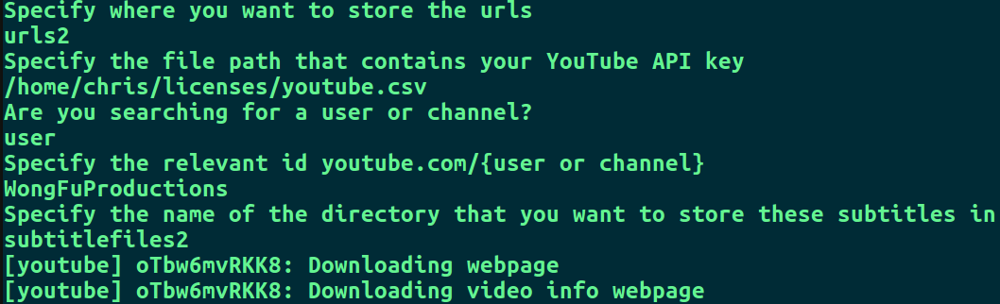
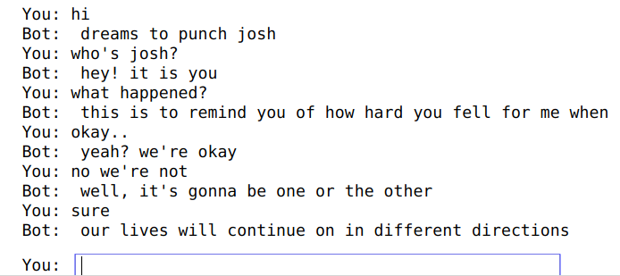
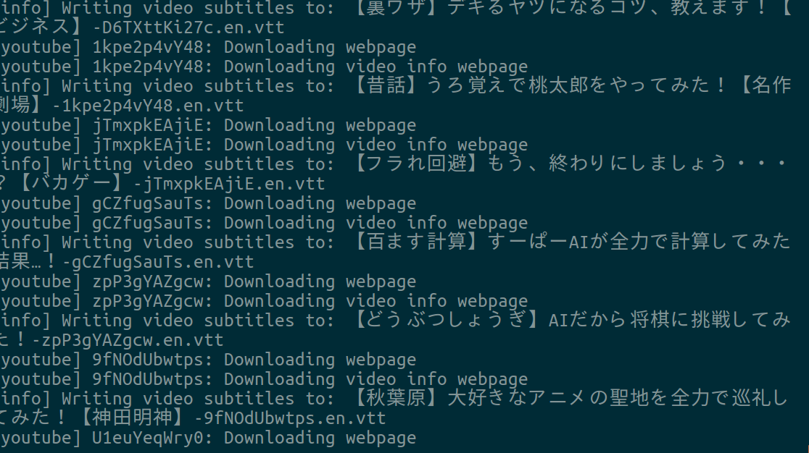

# YouTube Subtitle Project
- Bash script to automate downloading subtitles from YouTube API
- Subtitle preprocessing to clean messy subtitle text in Python
- Recommend similar videos based on GloVe and cosine similarity
- Chatbot trained on subtitles scraped from YouTube

## Preparing Subtitle Files

Simply run `download_subtitles.sh`.

Sample input is shown below.

## Video Recommendation

Open `word_embedding{-video2 optional}.ipynb` in Jupyter.

It will use cosine similarity on the subtitle text and recommend you the closest vectors.

## Chatbot Trained on Subtitles

Prototype -- doesn't work that well (may be due to training data quality)

## Appendix

Example of downloading subtitles

## Notes

- You will need a API key for Youtube for this to work.
https://developers.google.com/youtube/v3/getting-started

- `scrape_youtube_url.py`: Retrieves YouTube urls for a given user/channel
- `subtitle_processing{-video2 optional}.ipynb`: Clean subtitle text and save to pickle file
- `word_embedding{-video2 optional}.ipynb`: Use GloVe embeddings to recommend similar videos
- `urls{2}`: consists of url links stored in text file, one url per line
- `subtitlefiles{2}`: consists of raw subtitle files
- `obj/`: consists of pickle files (dictionary object consisting of video name and the corresponding subtitle text)
- `chatbot.ipynb`: simple chatbot implementation
- `scattertext-viz.{html,pynb}`: visualization of words from scattertext package
- `sentiment_analysis{-video 2 optional}.ipynb` : looking at sentiment of each video
- `summarize-video`.ipynb: summarizing the contents of video from subtitles

## Slides

See `slides.pdf`
